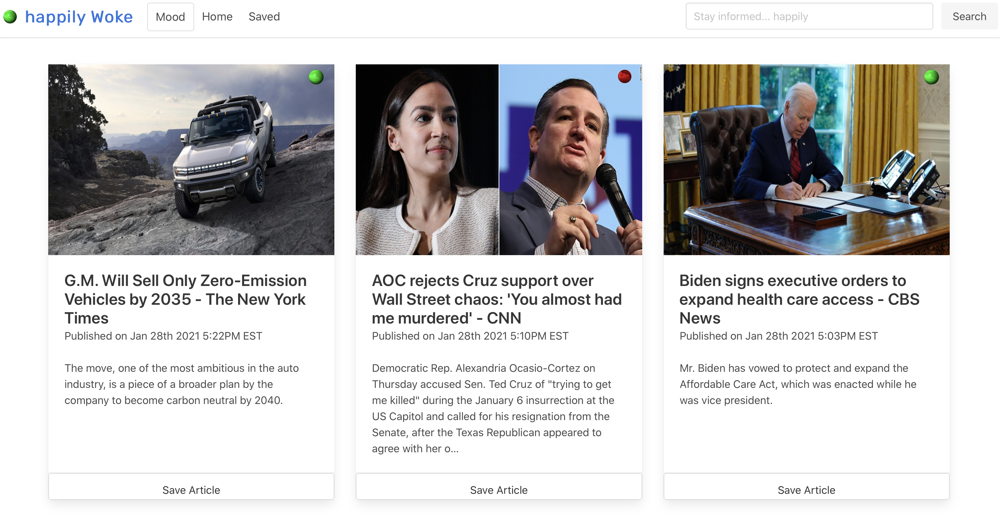
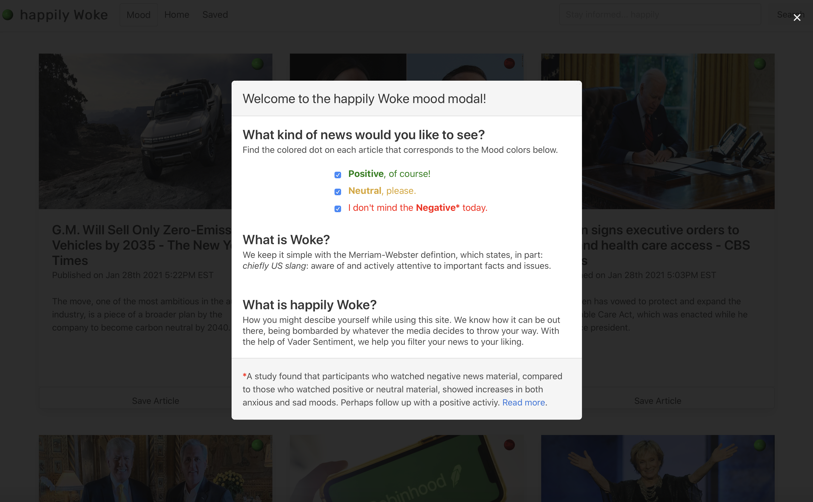

# Happily Woke

## Description

A minimalist news application, using vader-sentiment analysis to filter news headlines based on the mood. You can start by checking the mood you are feeling or which type of news you would like to see (positive, neutral, or negative). The page will then filter and display headline news according to the checked mood. You can also search for articles on any desired topic. You have the abilty to save articles to your "saved page" for future reading and reference.

The following image shows a glimpse of the application:

 
 

## Getting Started

This is a simple application that runs right in the browser, no installation or downloads needed. 

## Built With:

MongoDB - database 
Express - Server 
React - JavaScript Library 
Bulma - UI Framework
Node.js - JavaScript runtime

## Authors:
Natalie McKee  
Manuel Quispe 
Melissa Elie 
Berhane Teklemariam 
Alexis Esparza 
Leon Carnagie 

## Planned Updates

Planned updates include adding API calls for global news. The current API calls only allow for U.S news.
